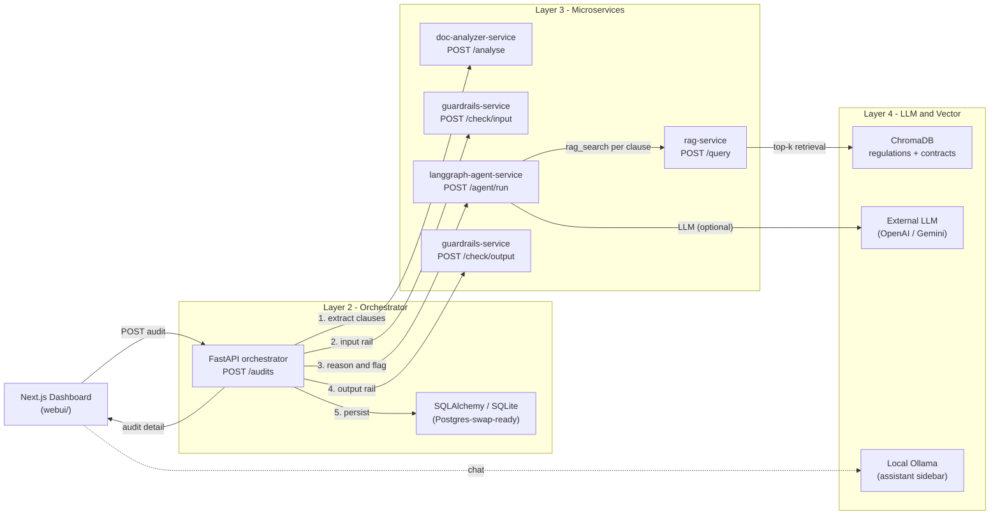
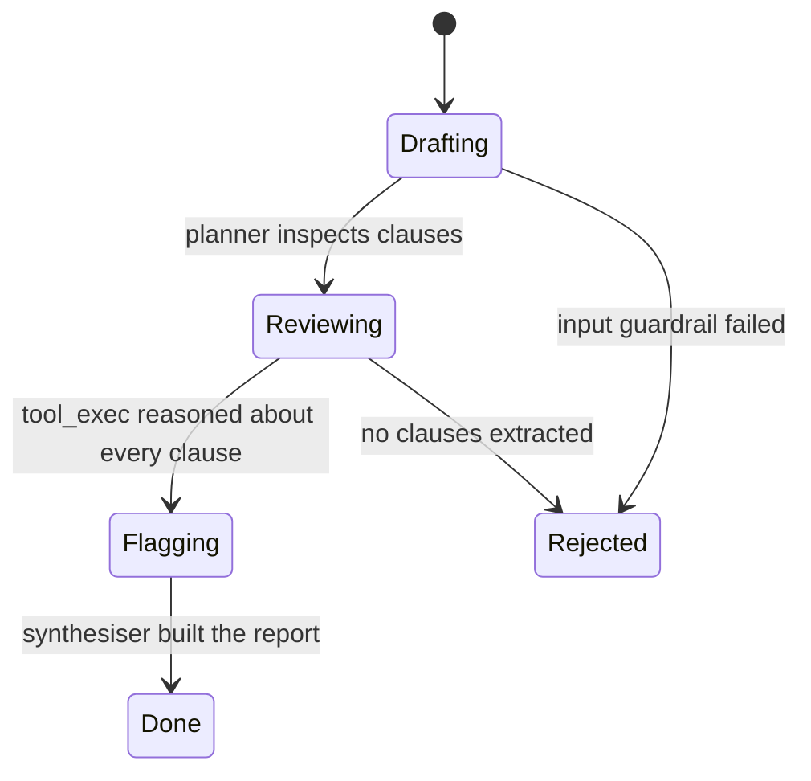
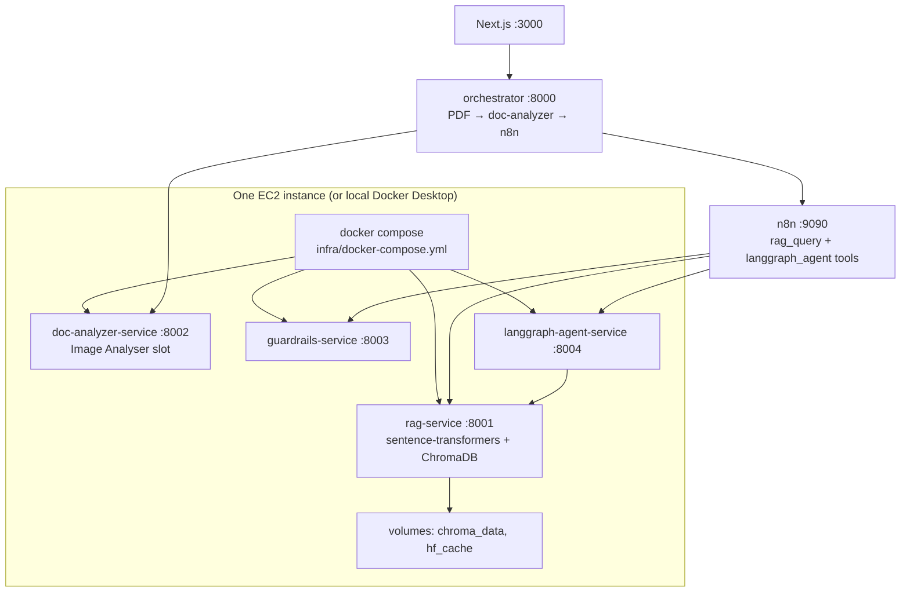

# Architecture — AI-Native Regulatory Document Auditor

This document is the project-specific architecture diagram annotated with
the design decisions made during the core-loop build. It is **not** a
copy of the reference PDF — it captures what was actually shipped.

## 1. The Compliance 360 reasoning loop



State machine inside the LangGraph agent:



## 2. Layers (1:1 with the reference PDF)

| Layer | Component | Tech | Port |
| --- | --- | --- | --- |
| 1 | webui | Next.js 14, Tailwind, hand-rolled shadcn-style components | 3000 |
| 2 | orchestrator | FastAPI (stand-in for n8n), SQLAlchemy / SQLite | 8000 |
| 3.1 | rag-service | FastAPI, ChromaDB, MiniLM / hashing fallback | 8001 |
| 3.2 | doc-analyzer-service | FastAPI, pdfplumber, heuristic clause segmenter | 8002 |
| 3.3 | guardrails-service | FastAPI, rule-based rails + optional OpenAI critic, Colang skeleton | 8003 |
| 3.4 | langgraph-agent-service | FastAPI, LangGraph StateGraph, rule + LLM reasoning | 8004 |
| 4 | external | OpenAI / Gemini, local Ollama, ChromaDB on-disk | n/a |

Layer 2 in production is **n8n** (`n8n/compliance_audit.json`, port 9090).
The FastAPI orchestrator (`:8000`) bridges the Next.js dashboard to n8n
and doc-analyzer; it mirrors the same node order as `pipeline.py`.

## 2b. Layer 3 — EC2 microservices (reference PDF alignment)

The reference architecture names four independent FastAPI services on EC2.
This project maps them as follows:

| Reference PDF slot | Shipped service | Primary API |
| --- | --- | --- |
| RAG | `rag-service` | `POST /query` |
| **Image Analyser** | **`doc-analyzer-service`** (repurposed) | `POST /analyse` |
| Guardrails | `guardrails-service` | `POST /check/input`, `POST /check/output` |
| LangGraph Agent | `langgraph-agent-service` | `POST /agent/run` |

**Image Analyser → doc-analyzer:** the PDF’s CNN/image pipeline slot is
adapted for **contract PDF clause extraction** (`pdfplumber`, optional OCR,
heuristic segmenter). The HTTP boundary (`POST /analyse`) is unchanged.

**Deployment topology:** one EC2 host (t3.small / t3.medium+), four
Docker containers via `infra/docker-compose.yml`. n8n and the orchestrator
may run on the developer machine or on a separate instance; they call Layer 3
over HTTP on ports 8001–8004.



Local start: `.\scripts\docker_layer3.ps1`  
EC2 start: `docker compose -f infra/docker-compose.yml up -d --build` then
seed with `scripts/seed_regulatory_corpus.py --remote http://localhost:8001 --reset`.

## 3. Data contracts (`shared/schemas/`)

All services depend on the editable-installed `auditor-schemas` package:

```text
ContractClause   id, contract_id, section, text, clause_type, page
RegulatoryClause id, source, article, title, text, tags
Finding          contract_clause_id, matched_regulatory_clause_id,
                 matched_regulatory_source, matched_regulatory_article,
                 verdict, risk, justification, confidence, safe_justification
Audit            id, filename, status, overall_risk, parties, jurisdiction,
                 contract_type, requester, clauses, findings,
                 report_markdown, safe_report_markdown,
                 input_guardrail_passed, output_guardrail_passed,
                 rejection_reason, created_at, updated_at
GuardrailResult  passed, reason, safe_text, matched_rules
```

`Verdict` and `RiskLevel` are enums (`compliant | non_compliant |
ambiguous`, `High | Medium | Low`).

## 4. Deliberate deviations from the reference PDF

1. **Frontend stack.** PDF says Gradio / Streamlit. We use **Next.js 14**
   to match the Figma Enterprise SaaS dashboard. The two are not
   reconcilable; this deviation is intentional.
2. **Orchestrator stand-in.** PDF assumes n8n drives the pipeline. We
   ship a FastAPI orchestrator that mimics the same node order and an
   `n8n/compliance_audit.json` skeleton, so the team can swap drivers
   without touching downstream services.
3. **PyTorch slot repurposed.** The PDF's "Image Analyser" (CNN room
   classifier) is replaced with the `doc-analyzer-service` which extracts
   and segments contract clauses. The PyTorch fine-tune itself is
   **deferred** to a future iteration (LayoutLMv3 / clause-type classifier).
4. **PostgreSQL planned but starting on SQLite.** The orchestrator's
   SQLAlchemy URL is `sqlite:///./data/auditor.db`; swap to
   `postgresql+psycopg://...` to deploy on Postgres without code changes.
5. **Sentence-transformers in Docker; hashing fallback on bare Windows.**
   The RAG Docker image pins CPU PyTorch 2.5.1 and loads MiniLM. A
   hashing-based fallback remains for dev installs without Torch.
6. **One EC2, four containers.** The reference “four microservices on EC2”
   is implemented as Docker Compose on a single instance, not four separate
   VMs (cost and ops trade-off documented for the thesis).

## 5. Reasoning safety (the "Safety" pillar)

Every AI-generated string follows this path before it reaches the user:

1. The LangGraph synthesiser produces `report_markdown` (and a
   `justification` per finding).
2. The orchestrator POSTs each justification *and* the full report to
   `guardrails-service /check/output`.
3. The rails detect (and rewrite) unqualified legal advice
   (`you must X`, `you should X`), definitive legality statements
   (`this is illegal`), guarantee language, and fabricated case
   citations.
4. The dashboard renders the **safe** text by default and surfaces the
   original behind a "View original (pre-guardrail) text" disclosure so
   reviewers can audit the rewrite.

## 6. Acceptance criteria — verified

`scripts/smoke_test.py` runs the entire reasoning loop in-process and
asserts:

* `len(clauses) >= 5` for the sample MSA
* input guardrail accepts the contract
* at least one `High`, `Medium`, and `Low` finding present
* every finding cites a real seeded regulatory clause id
* the output guardrail rewrites or accepts the synthesised report

Current run results: `2 High / 2 Medium / 5 Low`, `9/9` findings cited.
